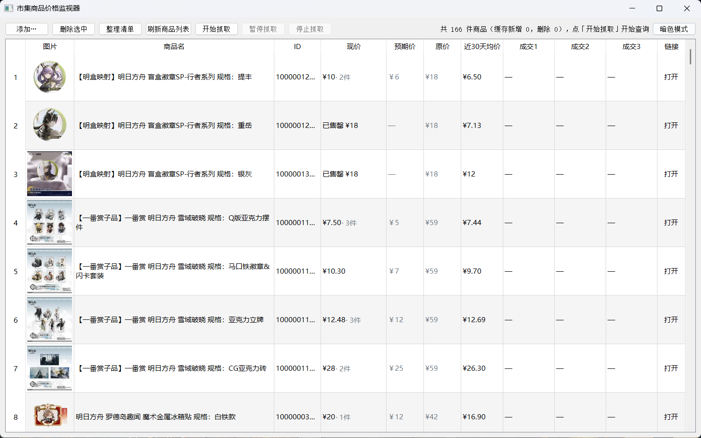
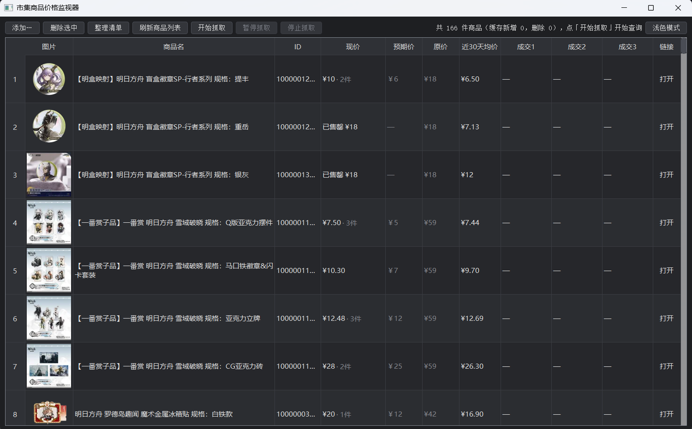
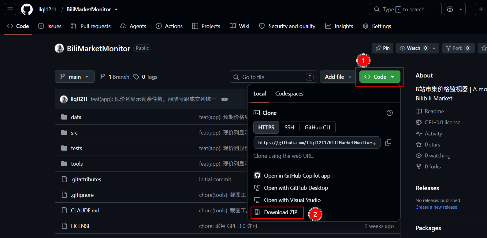
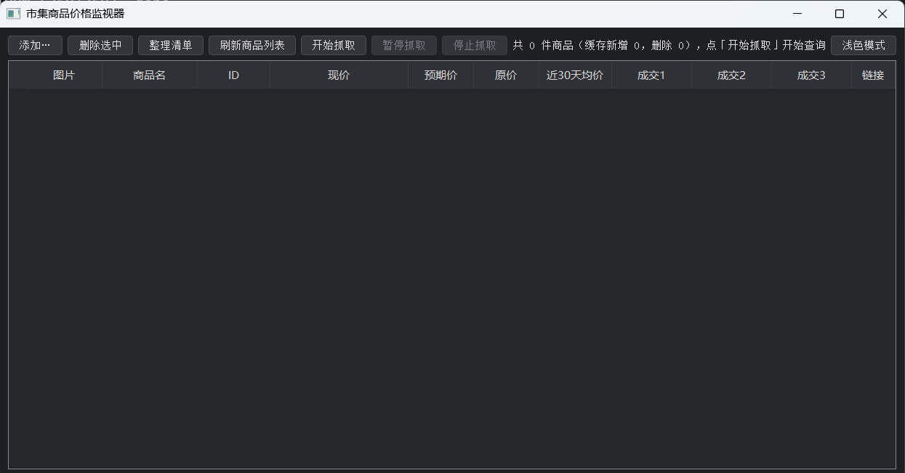

# BiliMarketMonitor | B站市集商品价格监视器

说明文档 | [技术文档](docs/architecture.md)

Bilibili 市集真是个好东西！低价购入谷子！（例如 [这个页面](https://mall.bilibili.com/neul-next/resell/detail.html?clusterId=10000007650)）

**附带市集的原理**：B站有魔力赏、惊喜赏等抽卡玩法，不过大概率抽到的是便宜货，也可能抽到不认识的 IP，这时候就可以拿到市集上售卖回血。因此，市集的商品都有一定的折扣。缺点是，买后如果立即发货需要 10r 左右运费，但放置约 30 天到期后可以自动发货（不过买谷子尽量挑有显示粉色条“市集自营”的商品，至少一手有保障）。

为了监视想要的谷子，我 vibe coding 了这个项目。只要输入需要追踪的商品，它就可以帮你持续追踪信息，包括：缩略图、现价、近期均价、最近成交记录；同时可以设置预期价格，低于预期价格时高亮显示。

<p align="center">


</p>

**致谢**：

感谢 moyu3739 大佬做的B站市集抓取，为本仓库提供了接口解析参考~ [仓库地址](https://github.com/moyu3739/Bmarket)

## 特点

1. **免登录、无需配置 Cookie**，数据来自商品详情页前端调用的接口。
2. 抓取显示商品的缩略图、现价、史低价、价格变化、剩余件数、原价、近 30 天均价、最近 3 条带时间的成交记录。
3. 可显示价格对比上次的变化，如 `¥44 ↓6 · 2件`，价格涨跌使用红色、绿色突出显示；
4. 可设置预期价格，低于预期价格时高亮显示；现价低于近 30 天均价时，均价那一格也会绿色加粗；现价正好是史低价（没比它贵）时，史低价那一格同样绿色加粗。
5. 可高亮显示近期（默认 24h）的新成交记录。
6. 每轮抓取结束后，自动弹出抓取报告，包括：本次抓取的件数与用时、价格变动涨跌、有近期成交的商品、价格低于预期的商品。
7. 缩略图可以双击放大显示。
8. 商品可以拖动排序，也可以单击“收藏”列打上星标。
9. 有“打开”按钮可以直接打开该商品链接详情。
10. 可以按固定间隔自动抓取，范围可选全部 / 仅收藏 / 仅售罄，间隔从上一轮结束算起。
11. 可以把提醒推送到企业微信群机器人（webhook 自备），不用一直守着窗口。

## 使用方法

### 1. 下载或克隆源码

下载源码与克隆源码二选一。

#### 下载源码

如果只是一次性使用，可以点击 github 仓库右上角的 `Code` 按钮，拉到最下方点击 `Download ZIP` 下载并解压。



之后需要在终端内打开当前目录。进入解压后的文件夹 `BiliMarketMonitor`，并按以下方式操作（来自 DeepSeek）：

**Windows**：

- 如果安装过 Git，推荐在解压后的文件夹空白处右键，选择 `Git Bash Here`。打开的窗口就已经在这个文件夹里了。
- 如果没有 `Git Bash Here`，可以点击文件资源管理器顶部的地址栏，输入 `cmd`，按回车。然后输入 `dir`，如果能看到 `README.md` 等项目文件，就说明位置正确。

**macOS**：

1. 打开“终端”应用。
2. 输入 `cd `，注意 `cd` 后面有一个空格。
3. 把解压后的文件夹从 Finder 拖进终端窗口，按回车。
4. 输入 `ls`，能看到项目文件即可。

**Linux**：

1. 在文件管理器里打开解压后的文件夹。
2. 在空白处右键，选择“在终端中打开”。
3. 输入 `ls` 确认能看到项目文件。

#### 克隆源码

如果有懂 git 的同学，想拉取以后的更新，或是想参与开发的，可以 clone 源码：

```bash
# 先移动到你想要下载的目录
cd <dir>  # 把 <dir> 替换成你的实际目录

# 然后 clone 仓库，下面两条二选一
git clone https://github.com/llql1211/BiliMarketMonitor <alias>  # （推荐）使用 https
git clone git@github.com:llql1211/BiliMarketMonitor <alias>      # 如配置了 ssh 可以使用该方式

# clone 完成后进入该目录
cd BiliMarketMonitor
```

### 2. 安装与启动

启动前，需要确保终端已经在项目文件夹 `BiliMarketMonitor` 下了，例如终端显示：

```bash
C:/Users/12345/BiliMarketMonitor >
```

项目使用 Python 编写，使用 Pixi 管理 Python 环境。有以下启动方式：

**直接 pip install（推荐）**:

```bash
# 安装依赖
python -m pip install .

# 启动应用
python src/app.py
```

**使用 Pixi 的用户**：

`pyproject.toml` 文件已经定义了 `start` 这个任务，可以直接启动：

```bash
# 安装依赖+启动应用
pixi run start
```

### 3. 添加并抓取商品

此时应用已打开，页面如下：



可点击右上角 `暗色模式/浅色模式` 进行外观切换。

#### 添加商品

添加商品有两种方式：

1. 点击左上角 `添加...` 按钮，在弹出的输入框内依次粘贴商品链接，一行一个链接，结束后点击“确定”。此时页面会新增几行，且 `ID` 列已填上数字，代表添加成功。
2. 进入 `BiliMarketMonitor/data/` 文件夹下，将 `watchlist.example.txt` 复制一份，并改名为 `watchlist.txt`。打开这个文件，向内一行行写商品链接，如：

```text
https://mall.bilibili.com/neul-next/resell/detail.html?clusterId=10000004212&noTitleBar=1&share_medium=android&bbid=XU8FF57870E1B13BBF6891E69F6F952B320E5
https://mall.bilibili.com/neul-next/resell/detail.html?clusterId=10000004245
```

链接只以 `clusterId` 为唯一标识符，会自动忽略 `noTitleBar, bbid` 等参数。

清单每行一件商品，规范格式是 `<clusterId> | <商品名> | <预期价> | <收藏>`，后三段都能省：

```text
10000004212 | Vsinger 洛天依拍立得相框 | 60 | *
10000004245
```

以 `#` 开头的行和空行会被忽略，重复的 ID 只保留第一个，预期价和收藏标记直接写在文件里。

#### 抓取商品

可以点击第一行的“开始抓取”按钮，也可以按下快捷键 `F5`。

抓取时表格会逐行刷新，状态栏显示 `查询中 3/12` 提示进度。抓取中可以“暂停抓取”（在两条商品之间生效，按钮变成“继续抓取”）或“停止抓取”（已抓到的结果会保留）。单个商品查询失败不影响其他商品。

只想抓刚加进来的那几件时，可以点“仅抓取新添加商品”：它只请求还没有价格的商品（刚添加的，以及一直没抓成功的），其他行的价格原样留着不动。

#### 自动抓取

不想每次都伸手按 F5，可以在配置文件里打开自动抓取，让它到点自己跑一轮。在 `data/config.toml` 里写（还没有这个文件就照下面「修改配置文件」一节建一个）：

```toml
auto_poll_enabled = true          # 是否启用自动抓取
auto_poll_interval_minutes = 30   # 自动抓取间隔（分钟），从上一轮结束算起
auto_poll_scope = "all"           # all / favorite / sold_out
auto_poll_show_summary = false    # 自动抓取跑完是否弹总结
```

- **间隔从上一轮结束算起**，不从上一次开始算：某轮抓得慢只会把下一轮往后推，不会两轮叠在一起。
- **`auto_poll_scope` 决定抓哪些**：`all` 是清单里全部商品；`favorite` 只抓收藏了的那几件；`sold_out` 只抓缓存里记着「已售罄」的——刚加进来、一轮都还没抓过的商品不算售罄，得先手动抓一轮进了缓存才算数。
- **自动抓取跑完不弹总结**（配置里 `auto_poll_show_summary = true` 才弹），省得挂着的时候被窗口打断；手动抓取照旧每轮都弹。
- **自动和手动不撞车**：自动那一拍要是正赶上手动抓取在跑，这一拍直接跳过，等当前这轮收尾再重新挂上。
- 抓取时状态栏会写明是自动抓的、抓的哪一档，如 `自动抓取（收藏）3/12`；手动抓取还是原来的 `查询中 3/12`。
- 关掉时窗口顶部那行字右边显示「自动：关」，打开后显示「自动：30 分钟 / 收藏」，扫一眼就能确认配置生效了。改完配置要重启程序才生效。

#### 企业微信推送

不想一直守着窗口，可以把提醒推到企业微信的群里（用群机器人），手机上和电脑上都能收到。在 `data/config.toml` 里写：

```toml
notify_enabled = true             # 总开关
notify_wecom_webhook = "https://qyapi.weixin.qq.com/cgi-bin/webhook/send?key=xxx"  # 自备
notify_min_interval_seconds = 60  # 两次推送的最小间隔（秒）
```

webhook 地址得自己弄一个：在企业微信里进一个群（可以自己建一个只有自己的群），群设置 → 群机器人 → 添加机器人，复制它给的地址。地址没填或填的不是企业微信的地址（不是 `https://qyapi.weixin.qq.com/` 开头），配置会被忽略并在启动时提示一句。

- **当前版本只做到「把消息发出去」**：推送通道是通的（发送在子线程里做，不卡界面；成功、失败都写在状态栏那一行，完整原因鼠标停上去能看全），但「抓到什么才该推」还没接上——所以现在开着 `notify_enabled` 也不会有消息。
- **`notify_min_interval_seconds` 是防刷屏的闸**：一轮里十件商品同时到价，也只该收到一条消息；间隔之内再有触发会先攒着，攒到下一轮一起发。
- **一条消息装的是这一轮的全部触发**，不是一件一条：多件商品合并成一条推出去。

> ⚠️ webhook 等于这个群的**发送权限**，拿到它的人就能往群里发消息。所以：只写在 `data/config.toml`（这个文件不进版本库，也不要在截图、日志、帖子里贴出来）；万一泄漏了，把那个机器人删掉重新建一个，旧地址随即失效。

`notify_*` 里的另外几项是「哪些情况值得打扰你」的开关，各自的默认值和含义见下面「修改配置文件」的配置表。

#### 顶部那行字

窗口最上面一行是 `上次更新时间：yyyy-mm-dd hh:mm:ss`，说的是表格里这屏数据是**什么时候抓的**：取各行缓存里最新的一次成功抓取时刻，抓取失败的行不刷新它。一件都没抓到过时显示「尚未抓取过」；把唯一抓过的商品删掉，这行也回到「尚未抓取过」——屏幕上确实一件数据都没有了。

这一行的最右边是自动抓取的状态（「自动：关」或「自动：30 分钟 / 收藏」），跟左边隔开一段距离，互不干扰。它是只看不点的提示，鼠标停上去有说明。

#### 表格各列

| 列 | 说明 |
| :---: | --- |
| 序号 | 清单顺序，拖动排序后自动重编，固定在左边缘 |
| 收藏 | 单击切换。收藏了是实心黄星 `★`，没收藏是空心灰星 `☆` |
| 图片 | 缩略图，双击可放大 |
| 商品名 | 鼠标悬停可看查询失败的原因 |
| ID | clusterID，商品在市集的唯一标识 |
| 现价 | 市集当前最低价。后面可能跟涨跌（`↑2.01` 红 / `↓6` 绿）和剩余件数（灰色的 `· 2件`，货少时才显示）。售罄时这一格装的是原价，前面标「已售罄」 |
| 史低价 | 历次抓到的现价里最低的那个，只降不升：抓到更低的就刷新，涨回去也不会改高。售罄那次抓到的数不算（那是原价，不是市集现价）。现价正落在史低价上时变绿加粗 |
| 预期价 | 双击设置，现价低于它时变绿加粗 |
| 原价 | 划线价，灰色显示 |
| 近30天均价 | 近 30 天的平均成交价，现价比它低时变绿加粗 |
| 成交1 / 2 / 3 | 最近的 3 条成交，形如 `¥205 · 8天前`；近 24 小时内的加粗高亮。程序刚打开、还没抓取时，这 3 格显示的是**上次抓到的**那几条，时间从「上次抓取的时刻」重新算起 |
| 链接 | 点“打开”用浏览器打开商品详情页 |

格子里出现的几种占位符：`—` 是没有数据，`…` 是还没抓到，`--` 是本轮抓取开始后被清空、还没刷到的行。

#### 按钮与操作

- **删除选中**：把选中的商品从清单和缓存里一并删掉（会弹出窗口确认）。
- **刷新列表**：重新读一遍 `watchlist.txt`。手工改过清单之后点它同步，清单里新增的补成新行、删掉的移除，已抓到的数据保留。读进来时会顺手把清单按规范格式 `<clusterId> | <商品名> | <预期价> | <收藏>` 重写一遍；要是文件里有认不出的行，这次就先不动它（免得把那几行写没了），状态栏会说一声。
- 点击「链接」列的「打开」用浏览器打开商品详情页。
- 查询失败的商品，把鼠标停在商品名上约 2 秒能看到失败原因。

### 高级技巧

#### 缩略图放大

缩略图双击放大。

#### 整理商品

1. 直接在应用里拖动整理：点击一行后将其向上或向下拖动。
2. 若需要整理的商品太多，可以打开 `data/watchlist.txt`，剪切粘贴目标商品到合适的位置，**一定要保存**，再点击应用内的“刷新列表”按钮。
3. 按住 `Ctrl` 键并点击商品，可以保持多选状态，进行拖动或删除。

#### 修改配置文件

如想修改默认配置，请移动到 `BiliMarketMonitor/data` 文件夹下，将 `config.example.toml` 复制一份，并改名为 `config.toml`，修改里面的参数。

| 配置项 | 默认值 | 说明 |
| --- | --- | --- |
| `detail_url_template` | `https://mall.bilibili.com/neul-next/resell/detail.html?clusterId={clusterId}` | 商品详情页链接模板，`{clusterId}` 是占位符。表格里"打开"按钮打开的就是它拼出来的地址；官方页面改版时改这里即可 |
| `poll_interval_seconds` | `2` | 相邻两次请求的间隔（秒），若商品太多可调小至 0.5 |
| `retry_interval_seconds` | `1` | 单个商品查询失败后，重试前的等待时间（秒） |
| `request_timeout_seconds` | `10` | 单次请求超时时间（秒） |
| `deal_highlight_within_hours` | `24` | 成交发生在多少小时以内就加粗高亮。写成 `0` 表示关闭高亮 |
| `deal_highlight_color` | `#e07000` | 高亮成交用的文字颜色，支持 `#rrggbb` 和颜色名（如 `orange`） |
| `auto_poll_enabled` | `false` | 是否启用自动抓取。只认 `true` / `false`，写成 `1` 或 `"true"` 会被忽略并退回默认值 |
| `auto_poll_interval_minutes` | `30` | 自动抓取间隔（分钟），从上一轮结束算起。必须大于 0 |
| `auto_poll_scope` | `"all"` | 自动抓取的范围：`all` 全部 / `favorite` 仅收藏 / `sold_out` 仅售罄。写错了按 `all` 处理 |
| `auto_poll_show_summary` | `false` | 自动抓取跑完是否也弹抓取总结 |
| `notify_enabled` | `false` | 是否启用企业微信推送。只认 `true` / `false` |
| `notify_wecom_webhook` | `""` | 企业微信群机器人的 webhook 地址，自备。留空表示不想推送；填了但不是企业微信的地址会被忽略。**这是敏感信息**，别外传、别提交进仓库 |
| `notify_min_interval_seconds` | `60` | 两次推送的最小间隔（秒）。必须大于 0 |
| `notify_on_restock` | `true` | 售罄 → 在售时推送 |
| `notify_on_favorite_target` | `true` | 收藏的商品低于预期价时推送 |
| `notify_on_favorite_lowest` | `false` | 收藏的商品创史低价时推送 |
| `notify_on_favorite_drop` | `false` | 收藏的商品降价时推送。价格上下波动很常见，**开着容易刷屏** |
| `notify_on_any_target` | `false` | 没收藏的商品低于预期价时也推送 |

#### 设置预期价格

双击商品的“预期价”列，填上预期价格（只用填写数字）。当商品降价到预期价以下时，会用绿色加粗高亮提示。

#### 收藏商品

单击表格最左边的“收藏”列即可切换：收藏了显示实心黄星 `★`，没收藏显示空心灰星 `☆`。抓取过程中也能点，随点随存。

收藏只是个自己看的标记，不影响抓取、排序和价格判断——想拿它记“特别想要的那几个”，点起来比翻清单快。它存在 `watchlist.txt` 里，收藏的行末尾多一段 `| *`：

```text
10000004212 | Vsinger 洛天依拍立得相框 | 60 | *
10000004245
```

手工在文件里加上 `| *` 再点“刷新列表”，效果跟点那颗星一样；反过来把这段删掉、刷新，星就灭了。

## 说明

- 本工具只做价格监视，不涉及下单。
- 数据来自市集详情页前端调用的无文档私有接口；默认每 2 秒查一件商品，嫌慢可在配置里调小间隔。
- 接口字段随时可能变，真变了对应位置会显示 `—` 而不是报错，悬停商品名可看原因。
- 清单 `watchlist.txt` 是唯一的跟踪标准；缓存（`cache.db`）只是加速用的，删掉重新抓一遍就能补回来。唯一的例外是「史低价」：它记的是历次抓取攒下来的结果，删掉缓存也好、把商品移出清单再拖回来也好，都补不回来，只能从下一轮抓取重新开始攒。
- 本项目与哔哩哔哩官方无关，是非官方工具。

## LICENSE

采用 **GNU General Public License v3.0**，全文见 [LICENSE](LICENSE)。
